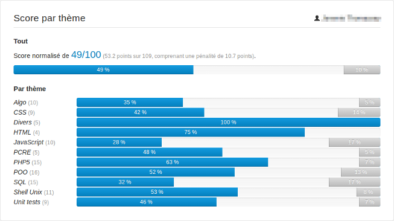

# Quizzes pour YunoHost

[](https://dash.yunohost.org/appci/app/quizzes)    
[](https://install-app.yunohost.org/?app=quizzes)

*[Read this readme in english.](./README.md)*
*[Lire ce readme en français.](./README_fr.md)*

> *Ce package vous permet d'installer Quizzes rapidement et simplement sur un serveur YunoHost.
Si vous n'avez pas YunoHost, regardez [ici](https://yunohost.org/#/install) pour savoir comment l'installer et en profiter.*

## Vue d'ensemble

Plate-forme de quizzes à choix multiples (QCM) avec interface d'analyse des résultats

**Version incluse :** 1.3.0~ynh1


## Captures d'écran




## Avertissements / informations importantes

First time credentials: 

```
Admin
test
```
## Documentations et ressources

* Site officiel de l'app : https://github.com/hipay/quizzes/
* Documentation officielle de l'admin : https://yunohost.org/packaging_apps
* Dépôt de code officiel de l'app : https://github.com/hipay/quizzes/
* Documentation YunoHost pour cette app : https://yunohost.org/app_quizzes
* Signaler un bug : https://github.com/YunoHost-Apps/quizzes_ynh/issues

## Informations pour les développeurs

Merci de faire vos pull request sur la [branche testing](https://github.com/YunoHost-Apps/quizzes_ynh/tree/testing).

Pour essayer la branche testing, procédez comme suit.
```
sudo yunohost app install https://github.com/YunoHost-Apps/quizzes_ynh/tree/testing --debug
ou
sudo yunohost app upgrade quizzes -u https://github.com/YunoHost-Apps/quizzes_ynh/tree/testing --debug
```

**Plus d'infos sur le packaging d'applications :** https://yunohost.org/packaging_apps